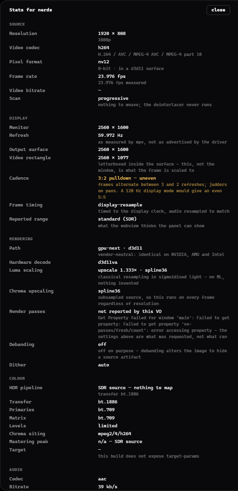

# Kinema

A media library for the films and TV shows already on your disk. It scans your
folders, finds the artwork and descriptions, remembers where you stopped, and
plays them — with no server, no account, and nothing running in the background.

Built because nothing existing fits. Every serverless option (Kodi) locks the
interface into skin XML, and every good-looking option (Jellyfin Media Player)
is a thin client that does nothing without a Jellyfin server running somewhere.
Kinema is one program: close it and nothing is left running.

**Windows 11 only.** See [Platform support](#platform-support).


<table>
<tr>
<td width="50%">


**Detail pages** carry the cast, the description and — for a series — every
season and episode, with progress on the ones you have started.

</td>
<td width="50%">



**Press `i` while watching** for what is actually happening: real refresh rate,
frame cadence, which scaler ran and why, and the colour pipeline end to end.

</td>
</tr>
</table>

## What it does

- **Finds your films and shows** by walking folders you nominate. It never reads
  file contents to identify them, so scanning a NAS stays cheap.
- **Fetches posters, backdrops, descriptions, cast and episode stills**, and
  caches them locally so browsing works with no connection.
- **Refuses to guess.** A match it is not confident about goes to a review queue
  with the reason, rather than silently attaching the wrong film to your file.
- **Plays through mpv** — the same engine as the standalone player — with
  hardware decoding, HDR tone mapping, PGS subtitles and 4K remuxes.
- **Remembers where you were**, per file, and offers the next episode.
- **Skips intros and credits**, from a community database, from chapter markers,
  or by fingerprinting a season's audio and finding what the episodes share.
- **Works from a sofa.** Every control is reachable with a D-pad, and there is a
  10-foot layout for a television.

It reads [NFO sidecar files](docs/DESIGN.md) if you have them, from MediaElch,
tinyMediaManager or Kodi, and treats them as authoritative.

## Install

Download the ZIP from [Releases](https://github.com/Basswaves/kinema/releases),
extract it anywhere, and run `kinema.exe`. There is no installer — it is a
folder, and deleting the folder uninstalls it.

### Windows will warn you

The executable is not code-signed, so SmartScreen shows **"Windows protected
your PC"** the first time. Click **More info**, then **Run anyway**.

This is expected for any unsigned program and is not a sign that something is
wrong — but you should not have to take that on faith. Every release publishes a
SHA-256 alongside the ZIP; compare it before you extract:

```powershell
Get-FileHash .\kinema-0.1.0-windows-x64.zip -Algorithm SHA256
```

Code signing costs a few hundred euros a year and does not make the program any
safer, only quieter. It may happen later.

## First run

The app opens on a setup panel with two steps.

1. **Add a folder.** Point it at where you keep your films, and another at your
   TV shows if they live somewhere else. Local drives and network shares both
   work. Nothing is moved, renamed or written to — the files are only read.

2. **Paste a TMDB key.** Optional but worth two minutes. TV shows already work
   without one, but films need it for posters, descriptions and artwork. It is
   free: the panel has a button that opens
   [the page you get one from](https://www.themoviedb.org/settings/api).

Then press **Scan my library**. The first scan takes a few minutes on a large
library; you can watch it fill in. After that it scans once at every start and
only looks at what changed.

Press **?** at any time — or the **?** button in the top bar — for the full list
of keys and remote buttons.

## Optional extras

None of these are bundled, downloaded or required. Each one adds a feature, and
without it that feature is skipped and everything else carries on.

| | What it adds | Without it |
|---|---|---|
| **[ffmpeg](https://ffmpeg.org/download.html)** | Kinema's own intro and credits detection, by fingerprinting a season's audio | Intros and credits come from TheIntroDB and chapter markers only |
| **[Skiptro](https://github.com/MikeSiLVO/skiptro-releases)** | A second, well-tuned intro detector that Kinema can run and read | The built-in detector handles it |

Put ffmpeg on your `PATH`, or point Settings at it. Skiptro is configured the
same way, at whatever path you installed it to — point Kinema at `skiptro.exe`,
the command-line one, not `Skiptro-Desktop.exe`.

**TheIntroDB** is on by default and needs nothing installed. It looks up
community-contributed intro and credits times, one episode at a time, when you
play it. Only the show's id, season and episode number are sent — no account, no
key, nothing about you. Turn it off in Settings if you would rather it did not.

## Platform support

Windows 11, using the WebView2 runtime that ships with it. Nothing else to
install.

Linux and macOS are not supported and are not close. The Rust half is nearly
platform-clean, but three things are not:

- The player asks mpv for the **d3d11** backend and **d3d11va** decoding by
  name, and those are in the set of options that abort mpv's startup if refused
  rather than falling back.
- The libmpv plugin has **no Wayland support** — window embedding goes through
  `--wid`, which Wayland does not offer.
- The whole architecture rests on **mpv rendering into a native surface beneath
  a transparent WebView2**, which is the part least likely to survive a move to
  WebKitGTK or WKWebView.

A port is welcome but it is real work, and it needs someone who can test it.

## Building from source

Windows 11, [Node](https://nodejs.org) 20+, [Rust](https://rustup.rs) with the
MSVC toolchain, and Microsoft C++ Build Tools.

```bash
npm install
```

Fetch the native playback libraries — about 95 MB, never committed:

```bash
npx tauri-plugin-libmpv-api setup-lib
```

That pulls an LGPL build of `libmpv-2.dll` and the plugin's wrapper into
`src-tauri/lib/`. See [NOTICE.md](NOTICE.md) for what that means licensing-wise.

```bash
npm run tauri dev
```

To build the portable app and put a shortcut on the desktop:

```bash
npm run app:build
```

`ffmpeg` on `PATH` is optional for development; without it the intro-detection
tests that need real media are skipped.

See [CONTRIBUTING.md](CONTRIBUTING.md) before changing anything — particularly
[docs/GOTCHAS.md](docs/GOTCHAS.md), which is required reading before touching the
player or D-pad navigation.

## When something goes wrong

Kinema writes two logs, next to `kinema.exe` in the folder you extracted (or in
`src-tauri/` when running from source):

- **`app.log`** — the app's own messages. The WebView2 console is invisible from
  outside the app, so this is where its errors go.
- **`mpv.log`** — the player's. This is the authority on anything about video:
  it records what actually happened in the render pipeline, not what was asked
  for.

Attach both to a [bug report](https://github.com/Basswaves/kinema/issues/new/choose).
They are the most useful thing you can send, and most problems here produce no
visible error at all — only a log line.

`F12` opens WebView2 DevTools in the app window.

## A word on how tested this is

Honestly: not very, outside one machine. Kinema was built for its author's
setup, and a good deal of it is calibrated against one display and one
television series — HDR passthrough, TV overscan, the intro-detection thresholds,
and behaviour on a library of several hundred films are all listed as unverified
in [docs/ROADMAP.md](docs/ROADMAP.md).

It is published at `0.1.0` for exactly that reason. If it does something strange
on your hardware, that is useful information rather than a nuisance.

## Documentation

| | |
|---|---|
| [CONTRIBUTING.md](CONTRIBUTING.md) | How to build, verify and submit a change |
| [docs/DESIGN.md](docs/DESIGN.md) | Architecture, data flow, and why each decision went the way it did |
| [docs/GOTCHAS.md](docs/GOTCHAS.md) | Traps in libmpv, Tauri, SQLite and spatial navigation. Every entry cost a real debugging round |
| [docs/PLAN.md](docs/PLAN.md) | What was built, in what order |
| [docs/ROADMAP.md](docs/ROADMAP.md) | What is left, and what each item is blocked on |
| [NOTICE.md](NOTICE.md) | Third-party licences and attribution |
| [SECURITY.md](SECURITY.md) | What the attack surface is, and how to report something |

## Licence

[MIT](LICENSE).

Kinema links against libmpv, which is LGPL, and the release bundles an
unmodified LGPL build of it that you are free to replace. It uses data from TMDB,
TVmaze and TheIntroDB, each under their own terms. [NOTICE.md](NOTICE.md) has the
detail.

This product uses the TMDB API but is not endorsed or certified by TMDB.
