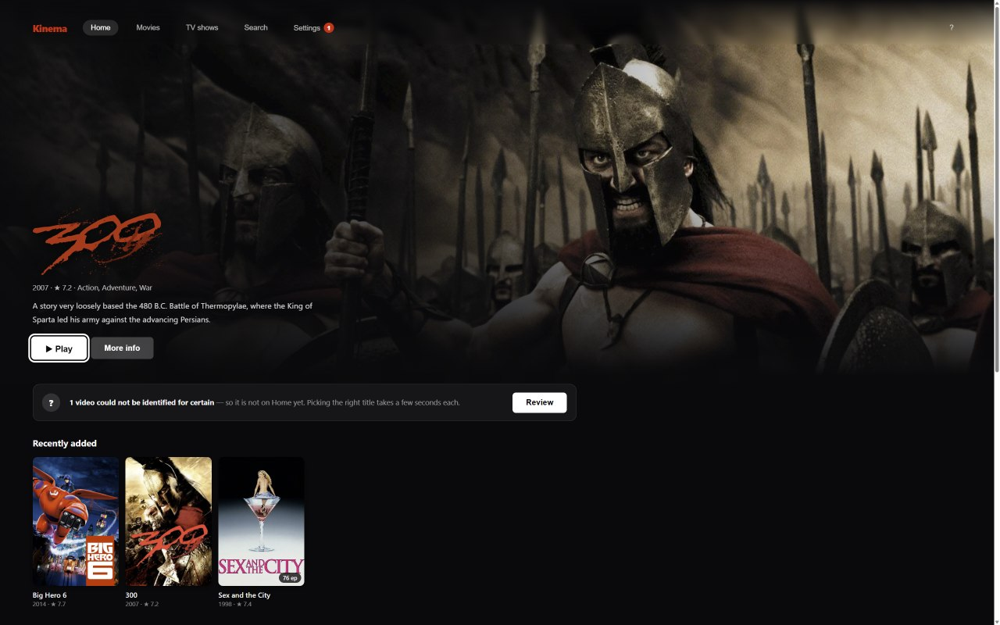
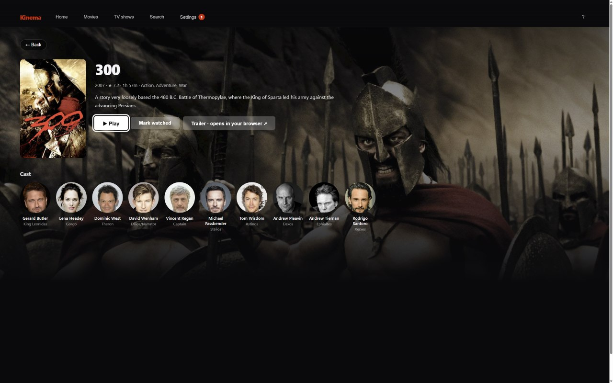
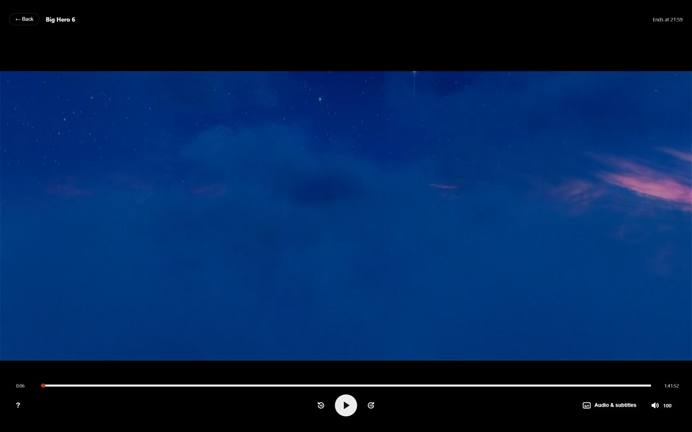
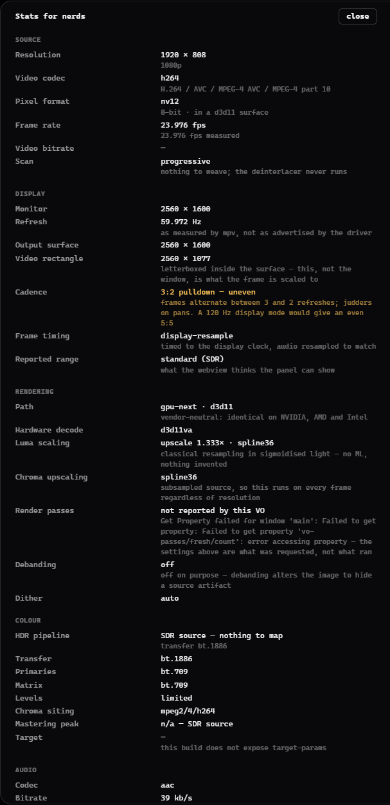

# Kinema

A media library for the movies and TV shows already on your disk. It scans your
folders, finds the artwork and descriptions, remembers where you stopped, and
plays them — with no server, no account, and nothing running in the background.

Built because nothing existing fits. Every serverless option (Kodi) locks the
interface into skin XML, and every good-looking option (Jellyfin Media Player)
is a thin client that does nothing without a Jellyfin server running somewhere.
Kinema is one program: close it and nothing is left running.

**Windows 11 only.** See [Platform support](#platform-support).





Detail pages carry the cast, the description and — for a series — every season
and episode, opening on the season you are in, with progress on the ones you
have started. Under the buttons, badges say what the file really holds — for a
series, what the season on screen holds, and which episodes differ — and
beside the year are its age rating and its IMDb, Rotten Tomatoes and TMDB
scores. Posters everywhere show what you have watched.



A remote works the way it does on any streaming app: **OK** pauses, **←/→**
seek (hold to go faster), and **↑/↓** bring up the controls — the seek bar,
audio and subtitles, volume. Back steps back to wherever you came from.

## What it does

- **Finds your movies and shows** by walking folders you nominate. It never reads
  file contents to identify them, so scanning a NAS stays cheap.
- **Fetches posters, backdrops, descriptions, cast and episode stills**, and
  caches them locally so browsing works with no connection.
- **Refuses to guess.** A match it is not confident about goes to a review queue
  with the reason, rather than silently attaching the wrong movie to your file —
  and Home tells you when something is waiting there.
- **Plays through mpv** — the same engine as the standalone player — with
  hardware decoding, HDR tone mapping, PGS subtitles and 4K remuxes.
- **Says what each file really holds.** A title's page shows the resolution,
  the Dolby Vision profile — with FEL or MEL — and HDR format, the exact sound
  format (TrueHD Atmos, DTS:X, DD+ Atmos), frame rate, bit depth and the aspect
  ratio measured from the picture itself, so a 2.39:1 film in a 16:9 file says
  2.39:1. Where it came from (UHD Blu-ray remux, WEB-DL…) is read from the
  release name; nothing else is.
- **Remembers where you were**, per file, and offers the next episode.
- **Keeps a safety copy** of your watch history, resume points and hand-made
  matches once a week, and puts one back from Settings if the library is ever
  damaged.
- **Skips intros and credits**, from a community database, from chapter markers,
  or by fingerprinting a season's audio and finding what the episodes share.
- **Works from a sofa.** Browsing, searching (with an on-screen keyboard),
  playing, subtitles and resume all work with a D-pad, and the TV layout fills
  the screen with bigger text.
- **Speaks your language.** Subtitles in your language when the audio is in
  another, and none when it is not — set once, remembered per show when you
  change it.
- **Gets the most out of your equipment.** If your TV or receiver can do better
  than Kinema is set to — Atmos and DTS:X untouched, 24p without judder, HDR —
  Home says so, and one press turns it on.



Press `i` while watching for what is actually happening: the display's real
refresh rate, the frame cadence, which scaler ran and why, and the colour
pipeline end to end. It reports rather than flatters — the cadence line above is
telling the truth about 24p on a 60 Hz panel.

It reads [NFO sidecar files](docs/DESIGN.md) if you have them, from MediaElch,
tinyMediaManager or Kodi, and treats them as authoritative.

## Install

Download the ZIP from [Releases](https://github.com/Basswaves/kinema/releases),
extract it anywhere, and run `kinema.exe`. There is no installer — it is a
folder, and deleting the folder uninstalls it.

### Windows will ask once whether to run it

The first time you open `kinema.exe`, Windows shows a blue box: **"Windows
protected your PC"**. Click **More info**, then **Run anyway**. Windows
remembers, and does not ask again.

It says that because Kinema is not *code-signed* — signed with a paid
certificate that tells Windows who made the program. That is all it means. It
is the same box for any small program from an independent developer, and it is
not a warning that something was found.

You should not have to take that on faith, so every release publishes a
checksum beside the ZIP. To check the file you downloaded is the one that was
published, run this in PowerShell in your Downloads folder and compare the
result with the one on the release page:

```powershell
Get-FileHash .\kinema-*-windows-x64.zip -Algorithm SHA256
```

Kinema asks GitHub for the latest version number when it starts, and says in
Settings when a newer one is out. It never downloads or installs anything by
itself — you download the new ZIP when you choose to.

## First run

The app opens on a setup panel that asks one thing: **where your videos are.**
Point it at where you keep your movies, and another at your TV shows if they
live somewhere else. Local drives and network shares both work. Nothing is
moved, renamed or written to — the files are only read.

Then press **Scan my library**. The first scan takes a few minutes on a large
library; you can watch it fill in. After that it scans once at every start and
only looks at what changed.

Posters, descriptions and artwork come from [TMDB](https://www.themoviedb.org),
through a key Kinema carries — there is nothing to sign up for. If you would
rather use a free TMDB key of your own, paste it in Settings → Library. Should
TMDB ever be out of reach, movies are still identified through Wikidata, just
without pictures.

Press **?** at any time — or the **?** button in the top bar — for the full list
of keys and remote buttons.

## Optional extras

None of these are bundled, downloaded or required. Each one adds a feature, and
without it that feature is skipped and everything else carries on.

| | What it adds | Without it |
|---|---|---|
| **[ffmpeg](https://ffmpeg.org/download.html)** | Kinema's own intro and credits detection, by fingerprinting a season's audio; and the picture and sound badges on a title's page — resolution, Dolby Vision, HDR, Atmos, the measured aspect ratio | Intros and credits come from TheIntroDB and chapter markers only; a title's page keeps its source, studio, age rating and scores, without the picture and sound badges |
| **[Skiptro](https://github.com/MikeSiLVO/skiptro-releases)** | A second, well-tuned intro detector that Kinema can run and read | The built-in detector handles it |
| **An [OMDb key](https://www.omdbapi.com/apikey.aspx)** (free) | Rotten Tomatoes scores on a title's page, in Settings → Library. Kinema spends at most half of a free key's daily lookups | IMDb's and TMDB's scores only |

Put ffmpeg on your `PATH`, or point Settings at it. Skiptro is configured the
same way, at whatever path you installed it to — point Kinema at `skiptro.exe`,
the command-line one, not `Skiptro-Desktop.exe`.

**TheIntroDB** is on by default and needs nothing installed. It looks up
community-contributed intro and credits times, one episode at a time, when you
play it. Only the show's id, season and episode number are sent — no account, no
key, nothing about you. Turn it off in Settings if you would rather it did not.

## Platform support

Windows 11, using the WebView2 runtime that ships with it. Nothing else to
install.

Linux and macOS are not supported and are not close. The Rust half is nearly
platform-clean, but three things are not:

- The player asks mpv for the **d3d11** backend and **d3d11va** decoding by
  name, and those are in the set of options that abort mpv's startup if refused
  rather than falling back.
- The libmpv plugin has **no Wayland support** — window embedding goes through
  `--wid`, which Wayland does not offer.
- The whole architecture rests on **mpv rendering into a native surface beneath
  a transparent WebView2**, which is the part least likely to survive a move to
  WebKitGTK or WKWebView.

A port is welcome but it is real work, and it needs someone who can test it.

## Building from source

Windows 11, [Node](https://nodejs.org) 20+, [Rust](https://rustup.rs) with the
MSVC toolchain, and Microsoft C++ Build Tools.

```bash
npm install
```

Fetch the native playback libraries — about 95 MB, never committed:

```bash
npx tauri-plugin-libmpv-api setup-lib
```

That pulls an LGPL build of `libmpv-2.dll` and the plugin's wrapper into
`src-tauri/lib/`. See [NOTICE.md](NOTICE.md) for what that means licensing-wise.

```bash
npm run tauri dev
```

To build the portable app and put a shortcut on the desktop:

```bash
npm run app:build
```

`ffmpeg` on `PATH` is optional for development; without it the intro-detection
tests that need real media are skipped.

See [CONTRIBUTING.md](CONTRIBUTING.md) before changing anything — particularly
[docs/GOTCHAS.md](docs/GOTCHAS.md), which is required reading before touching the
player or D-pad navigation.

## When something goes wrong

Kinema writes two logs to `%APPDATA%\com.kinema.app\logs\`. The quickest way
there is **Settings → Developer tools → Open log folder**:

- **`app.log`** — the app's own messages. The WebView2 console is invisible from
  outside the app, so this is where its errors go.
- **`mpv.log`** — the player's. This is the authority on anything about video:
  it records what actually happened in the render pipeline, not what was asked
  for.

Attach both to a [bug report](https://github.com/Basswaves/kinema/issues/new/choose).
They are the most useful thing you can send, and most problems here produce no
visible error at all — only a log line.

`F12` opens WebView2 DevTools in the app window.

## Known limitations

- **Windows 11 only** — see [Platform support](#platform-support).
- **Tested on a small number of setups.** HDR passthrough, bitstreaming to a
  receiver and display switching have been confirmed on a 4K HDR TV with an AV
  receiver; TV overscan, intro detection on many different shows, and libraries
  of several hundred movies have had less exposure. The roadmap lists what is
  unverified. If something behaves strangely on your equipment, the log files
  (below) are the most useful thing you can send.

## Documentation

| | |
|---|---|
| [CONTRIBUTING.md](CONTRIBUTING.md) | How to build, verify and submit a change |
| [docs/DESIGN.md](docs/DESIGN.md) | Architecture, data flow, and why each decision went the way it did |
| [docs/GOTCHAS.md](docs/GOTCHAS.md) | Traps in libmpv, Tauri, SQLite and spatial navigation. Every entry cost a real debugging round |
| [docs/HISTORY.md](docs/HISTORY.md) | How it was built, and why each decision went the way it did |
| [docs/ROADMAP.md](docs/ROADMAP.md) | What is next, what is not planned, and where help is wanted |
| [NOTICE.md](NOTICE.md) | Third-party licences and attribution |
| [SECURITY.md](SECURITY.md) | What the attack surface is, and how to report something |

## Licence

[MIT](LICENSE).

Kinema links against libmpv, which is LGPL, and the release bundles an
unmodified LGPL build of it that you are free to replace. It uses data from TMDB,
TVmaze, Wikidata, Wikipedia and TheIntroDB, each under their own terms. [NOTICE.md](NOTICE.md) has the
detail.

This product uses the TMDB API but is not endorsed or certified by TMDB.
